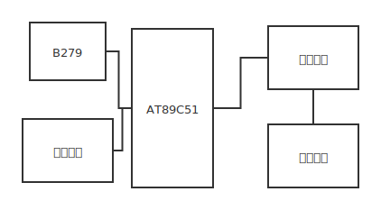
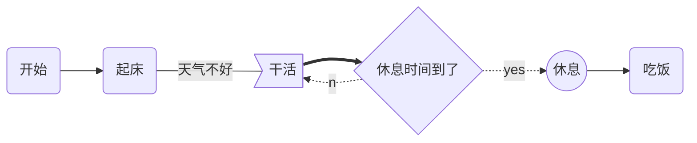

# 第2章 系统总体方案设计

## 2.1 系统工作原理

单片机温度控制系统是以AT89C51单片机为控制核心，辅以采样反馈电路，驱动电路，晶闸管主电路对电炉炉温进行控制的微机控制系统。系统的原理框图如图2-1所示，其基本控制原理为: 用键盘将温度的设定值送入单片机，并在发光二极管显示，启动运行后，通过信号采集电路将温度信号采集到后，送入单片机系统进行PID 控制运算，将控制量输出，改变可控硅管的接通时间便可改变加热丝功率，以达到调节温度的目的控制电阻炉的加热。

当由于环境温度变化太剧烈或由于加热或降温设备出现故障，或者温度传感头出现故障导致在一段时间内不能将环境温度调整到规定的温度限内的时候，单片机通过三极管驱动扬声器发出警笛声。 



图1-1为第一个设计方案，该方案的工作原理简述如下：


## 2.2 各模块设计

###  2.2.1 温度传感器电路

数字单线温度传感器DS18B20用作该主题的温度传感器。 4.7 K中传感器输出信号的上拉电阻直接连接到微控制器的P1.0引脚。

温度传感器DS18B20是美国达拉斯半导体公司的数字温度传感器，它使用单总线技术。 该器件在小型集成电路芯片上制造对温度敏感的半导体器件，A / D转换器，存储器等。 在对本设计中的温度传感器进行多次比较和考虑之后，选择了单线数字设备DS18B20，主要是由于以下原因：

1. 系统的特性：测温范围为-55℃～+125℃ ，测温精度为士0.5℃；温度转换精度9～12位可变，能够直接将温度转换值以16位二进制数码的方式串行输出；12位精度转换的最大时间为750ms；可以通过数据线供电，具有超低功耗工作方式。
2. 系统成本：由于计算机技术和微电子技术的发展，新型大规模集成电路功能越来越强大，体积越来越小，而价格也越来越低。一支DS18B20的体积与普通三极管相差无几，价格只有十元人民币左右。
3. 系统复杂度：由于DS18B20是单总线器件，微处理器与其接口时仅需占用1个I/O端口且一条总线上可以挂接几十个DS18B20，测温时无需任何外部元件，因此，与模拟传感器相比，可以大大减少接线的数量，降低系统的复杂度，减少工程的施工量。
4. 系统的调试和维护：由于引线的减少，使得系统接口大为简化，给系统的调试带来方便。同时因为DS18B20是全数字元器件，故障率很低，抗干扰性强，因此，减少了系统的日常维护工作。

DS18B20温度传感器只有三根外引线：单线数据传输总线端口DQ ，外供电源线VDD，共用地线GND。DS18B20有两种供电方式：一种为数据线供电方式，此时VDD接地，它是通过内部电容在空闲时从数据线获取能量，来完成温度转换，相应的完成温度转换的时间较长。这种情况下，用单片机的一个I/O口来完成对DS18B20总线的上拉。另一种是外部供电方式(VDD接+5V)，相应的完成温度测量的时间较短。

在本设计中采用外部供电方式实现DS18B20传感器与单片机的连接，其接口电路如图2-2所示。


## 2.3 通用键盘显示电路设计


如图2-3所示，ALE信号作为8279的时钟信号，从而与时钟同步。8279的中断信号IRQ接到单片机的P1.1引脚。缓冲器地址A0接到单片机的P2.5引脚，片选信号则接到单片机的P2.6引脚。读写信号分别和单片机的读写信号相连。8279的数据线D0-D7与单片机的数据线直接相连。

8279与AT89C51的许多信号是兼容的，可直接链接，十分方便。8279的8位数据线直接连接到AT89C51的P0口。读写信号分别于89C51的读写信号相连接。AT89C51的锁存信号ALE接8279的CLK，在内部分频后产生共内部时钟信号。8279的终端请求信号经一个反相器反向后接AT89C51的P1.1.AT89C51的三个可寻址寄存器只需要两个地址，即命令/状态寄存器地址和数据寄存器地址。8279中与地址有关的信号为A0和片选信号，它们的链接情况直接决定着寄存器的地址，一旦硬件电路确定，寄存器的地址也就确定下来了 。

发光二极管的发光效率和颜色取决于制造的材料，一般常用红色，偶尔也用黄色或绿色。发光二极管发光二极管是智能化测量控制仪表中简单而常用的输出设备，通常用来指示机器的状态或其他信息。它的优点是耗电省，配置灵活，接口方便，价格低，寿命长，对电流电压的要求不高及容易实现多路等。

LCD是一种被动显示器，它本身并不发光，只是调节光的亮度。目前常用的LCD是根据液晶的扭曲一向列效应原理制成的，可得到黑底白字或白底黑字的显示形式。对于采用电池供电的便携式智能化测量控制仪表，考虑到低功耗的要求，常常需要采用液晶显示器，它体积小，重量轻，功耗极低，因此在仪器仪表中的应用十分广泛。但是必须借助外来光显示。CRT显示器可以进行图形显示，但接口较复杂，成本也较高。 

在多路温度巡检仪中只需要显示4位数字形式的温度和路数，可以不必使用价格较高的CRT； 4位发光二极管的工作电流为240mA左右，由于使用交流电源供电，足以提供发光二极管显示器所需要的功率，对于发光二极管而言，仅有4位，体积也很小，这样比较发光二极管和 LCD的诸多特点，本系统选择 发光二极管显示器。
键盘是一组按键的组合，它的作用主要是控制系统的工作状态以及向系统中输入数据和命令，有编码式键盘和非编码式键盘两类。

编码式键盘除了按键之外，还包括了产生键码的硬件电路、去抖动电路和多键、窜键保护电路。每按下一个键，能自动产生这个键的键码，与此同时，产生一个脉冲信号，通知中央处理单元接收。这种键盘使用方便，接口程序简单，但是需要较多的硬件电路，价格较贵，一般的单片机应用系统较少采用。 

非编码式键盘仅由排成行、列矩阵形式的按键组成，按键的作用只是简单的实现接点的接通或断开，键的去抖动、键的编码的形成和键的识别等均由软件来完成。由于它经济实用，在单片机应用系统中广泛采用。

经过以上对比，可以采用非编码式键盘。

P0口：P0口为一个8位漏级开路双向I/O口，每脚可吸收8TTL门电流。当P1口的管脚第一次写1时，被定义为高阻输入。P0能够用于外部程序数据存储器，它可以被定义为数据/地址的第八位。在FIASH编程时，P0 口作为原码输入口，当FIASH进行校验时，P0输出原码，此时P0外部必须被拉高。

P1口：P1口是一个内部提供上拉电阻的8位双向I/O口，P1口缓冲器能接收输出4TTL门电流。P1口管脚写入1后，被内部上拉为高，可用作输入，P1口被外部下拉为低电平时，将输出电流，这是由于内部上拉的缘故。在FLASH编程和校验时，P1口作为第八位地址接收。   

P2口：P2口为一个内部上拉电阻的8位双向I/O口，P2口缓冲器可接收，输出4个TTL门电流，当P2口被写“1”时，其管脚被内部上拉电阻拉高，且作为输入。并因此作为输入时，P2口的管脚被外部拉低，将输出电流。这是由于内部上拉的缘故。P2口当用于外部程序存储器或16位地址外部数据存储器进行存取时，P2口输出地址的高八位。在给出地址“1”时，它利用内部上拉优势，当对外部八位地址数据存储器进行读写时，P2口输出其特殊功能寄存器的内容。P2口在FLASH编程和校验时接收高八位地址信号和控制信号。

P3口：P3口管脚是8个带内部上拉电阻的双向I/O口，可接收输出4个TTL门电流。当P3口写入“1”后，它们被内部上拉为高电平，并用作输入。作为输入，由于外部下拉为低电平，P3口将输出电流（ILL）这是由于上拉的缘故。 

P3口也可作为AT89C51的一些特殊功能口，如下表所示：   


| 管脚 |          备选功能           |
| :--: | :-------------------------: |
| P3.0 |      RXD（串行输入口）      |
| P3.1 |      TXD（串行输出口）      |
| P3.2 |     /INT0（外部中断0）      |
| P3.3 |     /INT1（外部中断1）      |
| P3.4 |    T0（记时器0外部输入）    |
| P3.5 |    T1（记时器1外部输入）    |
| P3.6 | /WR（外部数据存储器写选通） |
| P3.7 | /RD（外部数据存储器读选通） |

P3口同时为闪烁编程和编程校验接收一些控制信号。  

RST：复位输入。当振荡器复位器件时，要保持RST脚两个机器周期的高电平时间。   ALE/PROG：当访问外部存储器时，地址锁存允许的输出电平用于锁存地址的地位字节。在FLASH编程期间，此引脚用于输入编程脉冲。在平时，ALE端以不变的频率周期输出正脉冲信号，此频率为振荡器频率的1/6。因此它可用作对外部输出的脉冲或用于定时目的。然而要注意的是：每当用作外部数据存储器时，将跳过一个ALE脉冲。如想禁止ALE的输出可在SFR8EH地址上置0。此时， ALE只有在执行MOVX，MOVC指令是ALE才起作用。另外，该引脚被略微拉高。如果微处理器在外部执行状态ALE禁止，置位无效。   

PSEN：外部程序存储器的选通信号。在由外部程序存储器取指期间，每个机器周期两次/PSEN有效。但在访问外部数据存储器时，这两次有效的/PSEN信号将不出现。 

EA/VPP：当/EA保持低电平时，则在此期间外部程序存储器（0000H-FFFFH），不管是否有内部程序存储器。注意加密方式1时，/EA将内部锁定为RESET；当/EA端保持高电平时，此间内部程序存储器。在FLASH编程期间，此引脚也用于施加12V编程电源（VPP）。   

XTAL1：反向振荡放大器的输入及内部时钟工作电路的输入。   

XTAL2：来自反向振荡器的输出。

### 2.3.1 振荡器特性

XTAL1和XTAL2分别为反向放大器的输入和输出。该反向放大器可以配置为片内振荡器。石晶振荡和陶瓷振荡均可采用。如采用外部时钟源驱动器件，XTAL2应不接。有余输入至内部时钟信号要通过一个二分频触发器，因此对外部时钟信号的脉宽无任何要求，但必须保证脉冲的高低电平要求的宽度。

### 2.3.2 芯片擦除

可以通过组合正确的控制信号并将ALE引脚保持低电平10 ms来完成整个PE-ROM阵列和三个锁存位的电擦除。在芯片擦除操作中，代码阵列均被写入“ 1”，并且必须在重复编程非空存储字节之前执行此操作。

此外，AT89C51配备了固定逻辑，该逻辑在低频至零频率下可以是静态的，并支持两种软件可选的关断模式。空闲时中央单元停止工作。但是，随机存取存储器，计时器，计数器，串行接口和中断系统继续工作。在关机模式下，将保存随机存取存储器的内容，并冻结振荡器，并停用所使用的其他芯片功能，直到下一次硬件复位为止。

许多尚不了解51单片机的互联网用户会遇到以下问题：书籍和在线教程中的AT89S51是什么？ 8051、89C51等，但尚未听说过89S51。

在这里，初学者应阐明单片机实际使用的产品概念。 MCS-51单片机是美国INTE公司于1980年推出的产品。典型产品有8031（没有内部程序存储器，实际使用已从市场上淘汰），8051（芯片使用HMOS，功耗为630mW，是89C51的五倍）已根据实际用途注明日期）。到目前为止，8751和其他通用产品仍是兼容的MCS-51核心系列微控制器（目前已停产89S51、89C51等）。在大学和职业学校的培训文档中，MCS-51微控制器仍然用作基础理论学习的代表。

在某些文档中，8051甚至被称为MCS-51系列单片机。 8051是早期最典型的代表。由于MCS-51单片机具有深远的意义，因此许多公司推出了兼容系列的单片机，这意味着MCS-51内核确实存在。成为8位微控制器的标准。

其他公司的51 MCU产品与MCS-51内核兼容。相同的程序，在每个微控制器制造商的硬件上执行的结果都是相同的，例如我们经常说的89C51，例如ATMEL 89C51（已停产），89S51，PHILIPS（飞利浦）和WINBOND（Winbond）等。已经停产的是指ATMEL公司的AT89C51单片机。同时，许多功能在原始基础上得到了改进，例如B.时钟。闪存越好（程序存储器的内容至少可以重写1000次）。只读存储器（一次写入），AT89C51的性能远远优于8051。

关于市场营销，PIC单片机阵营对89C51提出了质疑。 89C51的最严重问题是它不支持ISP（在线更新程序）功能。需要添加诸如ISP功能之类的新功能以继续MCS-51图例。在这种情况下，89S51取代了89C51。目前，89S51是实际应用市场中的新宠。市场份额最大的Atmel已停止生产AT89C51，并将改用AT89S51。 89S51在技术上进行了改进。 89S51使用新的0.35工艺，可降低成本，改善功能并提高竞争力。 89SXX可以与89CXX等51系列芯片兼容。同时，Atmel不再接受89C的订单。您在市场上看到的89C51实际上是Atmel以前生产的大量库存。


##  2.4 8279芯片简介

###  2.4.1 引脚介绍

8279采用单±5V电源供电，40脚封装。

DB0～DB7:双向数据总线，用来传送8279与中央处理单元之间的数据和命令。

CLK:时钟输入线，用以产生内部定时的时钟脉冲。

RESET:复位输入线，8279复位后被置为字符显示左端输入，二键闭锁的触点回弹型式，程序时钟前置分频器被置为31,RESET信号为高电平有效。

CS:片选输入线，低电平有效，单片机在CS端为低时可以对8279读/写操作。

A0:缓冲器低位地址，当A0为高电平时，表示数据总线上为命令或状态， 当为低电平时，表示数据总线上为数据。

RD:读信号输入线，低电平有效，将缓冲器读出，数据送往外部总线。

WR:写信号输入线，低电平有效，将缓立器读出,将数据从外部数据总线写入8279的缓冲器。

RL2-- 1 40 --VCCRL3-- 2 39 --RL 1  
CLK-- 3 38 --RL 0  
IRQ-- 4 37 --CNTL/STB  
RL4-- 5 36 --SHIFT  
RL5-- 6 35 --SL 3  
RL6-- 7 34 --SL 2  
RL7-- 8 33 --SL 1  
RESRT-- 9 32 --SL 0  
RD-- 10 31 --OUT B0  
WR-- 11 30 --OUT B1  
DB0-- 12 29 --OUT B2  
DB1-- 13 28 --OUT B3  
DB2-- 14 27 --OUT A0  
DB3-- 15 26 --OUT A1  
DB4-- 16 25 --OUT A2  
DB5-- 17 24 --OUT A3  
DB6-- 18 23 --BD  
DB7-- 19 22 --CS  
VSS-- 20 21 --A0

IRQ:中断请求输出线，高电平有效，在键盘工作方式下，当FIFO/传感器随机存取存储器中有数据时，此中断线变为高电平，在FIFO/传感器随机存取存储器每次读出时，中断线就下降为低电平，若在随机存取存储器中还有信息，则此线重又变为高电平。在传感器工作方式中， 每当探测到传感器信号变化时，中断线就变为高电平。

SL0～SL3:扫描线，用来扫描按键开关，传感器阵列和显示数字， 这些可被编程或被译码。

RL0～RL7:回送线，经过按键或传感器开关与扫描线联接， 这些回送线内部设置有上拉电路，使之保持为高电平，只有当一个按闭合时，对应的返回线变为低电平；无按键闭合时，均保持高电平。

SHIFT:换位功能，当有开关闭合时被拉为低电平，没有按下SHIFT开关时，SHIFT输入端保持高电平，在键盘扫描方式中，按键一闭合，按键位置和换位输入状态一起被存贮起来。

CNTL/STB:当CNTL/STB开关闭合时将其拉到低电平，否则始终保持高电平， 对于键盘输入方式，此线用作控制输入端，当键被按下时，按键位置就和控制输入状态一起被存贮起来，在选通输入方式中，作选通用，把数据存入FIFO 随机存取存储器中。

OUTA3～OUTA0及OUTB3～OUTB0:显示输出A口及B口，这两个口是16×4切换的数字显示。这两个端口可被独立控制，也可看成一个8位端口。

BD:空格显示,此输出端信号用于在数字转换时将显示空格或者用显示空格命令控制其显示空格字符。

VCC:+5V电源输入线。

VSS:地线输入线。

###  2.4.2 8279的编程方法

8279可按其功能分为:键盘功能块;显示功能块;控制功能块;与中央处理单元接口功能块控制功能块包括控制和定时寄存器，定时和控制,扫描计数器三部分,它主要用来控制键盘和显示功能块工作。

控制和定时寄存器:用于存贮来自中央处理单元的编程命令,中央处理单元对8279编程以确定键盘与显示器工作方式和其它工作条件时,先把命令控制数据放到数据总线上,然后使A0=1,WR=0CS=0,并在WR上升沿把命令键存在控制和定时寄存器中,并经译码，建立适当的功能。

定时和控制:它含基本的定时计数器,第一个计数器是一个分频系数为2-31的前置定时器，分频系数可由程序预置,使内部频率为100KHz,从而能给出5.1ms键盘扫描时间和10.3ms反跳时间,其它计数器将此基本频率分频后,提供适当的按键扫描.行扫描.键盘阵列扫描.以及显示器扫描次数。

扫描计数器:扫描计数器有两种工作方式,在编码工作方式时,计数器提供一种二进制计数,通过管脚SL0-SL3输出后经外部译码才能提供给键盘和显示器的扫描作用,在译码工作方式时,扫描计数器对最低二位进行译码,SL0-SL3输出4选1的译码信号,作为显示器和键盘的译码扫描。

键盘功能块包括:返回缓冲器,键盘反跳及控制,8x8 FIFO传感器随机存取存储器,FIFO/传感器随机存取存储器状态。

#### 返回缓冲器与键盘反跳及控制

8条返回线被返回缓冲器缓冲,在键盘工作方式中,这几条线被逐个检测,以找出该行键中闭合的键,如果反跳电路测知某键闭合,则它等待10.3ms,然后重核此键是否仍然闭合,如果仍闭合,那么该键在矩阵中的行列地址以及SHIFT和CNTL的状态一起被送到FIFO随机存取存储器中,其在FIFO 随机存取存储器中的数据格式如下:

D7 D6 D5 D4 D3 D2 D1 D0  
CNTL SHIFT SCAN RET URN

数据格式中,最高位CNTL,次高位为SHIFT状态,D5-D3来自扫描计数器,D2-D0来自返回计数器，扫描线计数器和回扫线计数器的值分别反映出被按下键的行.列的值,如果在传感器阵列中,返回线上的数据直接进入传感器随机存取存储器中相应于阵列中正被扫中的那行,这样每个开关位置就直接反映为一个传感器随机存取存储器的位置。

#### FIFO/传感器随机存取存储器

一个8x8 随机存取存储器,在键盘方式和选通方式中它是一个先入先出(FIFO)存贮器，每一条新的信息顺次写入,然后又按写入顺序读出,在传感器阵列扫描方式时，存贮器作为传感器随机存取存储器,这时随机存取存储器中的各行存着传感器阵列中相应行的状态。

#### FIF0/传感器随机存取存储器状态

在键盘或选通方式中,FIFO状态跟踪FIFO中字符数量注意它是"满"还是"空",写入或读出过多均被认作出错,当FIFO非空时,状态逻辑提供一个中断申请IRQ信号,在传感器阵列扫描方式中,若测知某一传感器变化时,IRQ则为有效高电平.FIFO状态字的低3位表示FIFO中的字符数,F表示FIFO随机存取存储器已满;O(over mn)表示越限错误,即试图向已满的FIFO送另一字符;U(Under done)表示取空错误,即试图读取已空的FIFO.S/F有两种含义:在传感器扫描方式时,S/F表示在传感器随机存取存储器中至少包含了一个传感器闭合指示,在特殊错误方式时S/F位是出错标志,用来指示是否发生了多路同时闭合错误,Du位表示由于 CLEAR DISPLAY或CLEAR ALL命令尚末完成其消除操作而使显示随机存取存储器尚不可用。

显示功能块包括:显示寄存器,16X8显示随机存取存储器,显示地址寄存器)

#### 显示随机存取存储器和显示寄存器

8279内部有16X8的显示随机存取存储器,通过显示寄存器和两个四位端口0UT A0-3,0UT BO-3来刷新显示,显示器可以是白炽灯,也可以是8段数码管,显示随机存取存储器可以是16X8的形式,也可以构成两个16x4的随机存取存储器形式,显示随机存取存储器可由中央处理单元进行读写,被读写的随机存取存储器字节地址由显示地址寄存器指示.显示[地址寄存器保存当前中央处理单元读或写随机取存储器地址,以及正显示着的那两个4位半字节的地址,读写地址由中央处理单元命令[编程],也可置为每次读写后地址自动加1的工作方式,在设置了正确的工作方式后,显示随机存取存储器可由中央处理单元读出,半字节A和半字节B地址自动由8279更新,以适应由中央处理单元送入的数据,A和B半字节可独立送入,也可作为一个字送入,随中央处理单元所设置的工作方式而定。

#### I/O 接口功能块

8279通过与I/O控制,使8279与中央处理单元系统总线接口,I/O控制部分用CS.A0.RD和WR四条线控制中央处理单元与8279之间的数据交换,数据缓冲器是数据交换的双向通道,控制信号与数据交换间的逻辑关系见下表:

CS A0 WR RD

1 0 中央处理单元从8279读状态

0 1 0 1 中央处理单元向8279写状态

1 0 中央处理单元从8279读数据

0 0 1 中央处理单元向8279写数据

1 X X X 数据缓冲器输出呈三态

x为任意数(0或1)

### 2.4.3 8279的操作

由前所述,8279可适应各种键盘和显示器的不同工作方式,这是由于8279内的各功能块的工作是可程控的,用户可根据自己的要求,利用向8279写命令字的方法对8279的工作方式等进行编程,从上表可见,只要同时使CS=0 WR=0A0=1,则可向8279写命令字,并在wR的上升沿把命令打入8279。

对中央处理单元而言,8279只有两个口地址,一个用于读写命令和状态(CS=0,A0=1),一个用于读写数据(CS=0,A0=0)但用于编程命令字却有多种,在8279中用于区别各种不同命令字的方法是命令字代码的高3位(D7,D6,D5,)编码而低5位是命令字的真正内容

#### 8279的编程命令

键盘/显示器方式设置

| 最高位   | 最低位          |
| -------- | --------------- |
| 命令代码 | 0 0 0 D D K K K |

其中DD为显示方式,KKK为键盘方式

DD的表示：

| 编码 | 功能                      |
| ---- | ------------------------- |
| 00   | 8个8位字符显示--左端传入  |
| 01   | 16个8位字符显示--左端送入 |
| 10   | 8个8位字符显示--右端送入  |
| 11   | 16个8位字符显示--右端送入 |


所谓左端送

| 编码  | 功能                  |
| ----- | --------------------- |
| 0 0 0 | 编码扫描键盘--2键连锁 |
| 0 0 1 | 译码扫描键盘--2键连锁 |
| 0 1 0 | 编码扫描键盘--N键巡回 |
| 0 1 1 | 译码扫描键盘--N键巡回 |
| 1 0 0 | 编码扫描传感器阵列    |
| 1 0 1 | 译码扫描传感器阵列    |
| 1 1 0 | 选通输入,编码显示扫描 |
| 1 1 1 | 选通输入,译码显示扫描 |

其中2键连锁和N键巡回是8279对键盘中被按下键的两种处理方式,编码扫描和译码扫描是SL0-SL3 对链盘和显示器的两种扫描形。

程序时钟

命令代码 0 0 1 P P P P P

此命令确定定时和控制中的前置定标器的分频系数,代码PPPPP可形成2-31的数,前置定标器可对外部时钟分频,以得到内部基频,选基频为100KHZ,可得到前面规定的扫描和反跳时间,则分频系数为;外部时钟100KHZ复位脉冲过后若无代码送入则自动为31。

读FIF0/传感器随机存取存储器

命令代码:0 1 0 AI X A A A X=任意

此命令用于确定中央处理单元读操作的对象是8279中的FIF0/传感器 随机存取存储器,并确定8个 随机存取存储器 字节中哪一个被读,其中 AAA表示中央处理单元要读的行,AI为自动加1特征位,在键盘扫描方式中这两者互不相干,对随后的每次读取8279都按照数据第一次进入的FIF0的同一顺序自动送出数据,所有随后发生的读,都是读自FIFO,直到写入新命令为止.在传感器阵列方式中,AAA选择传感器随机存取存储器 8行中的一行若AI=1,则下一次读取便读自传感器随机存取存储器中的下一行。

读显示器随机存取存储器

命令代码:0 1 1 AI A A A A

中央处理单元对8279写此命令,则确定了 中央处理单元 以显示器 随机存取存储器为数据源进行读操作,其中AAAA为显示器随机存取存储器的地址,AI 为自动加1特征位,若AI=1,则每读一行随机存取存储器之后[行地址]自动加1。

写显示器随机存取存储器

命令代码: 1 0 0 AI A A A A

中央处理单元向8279写此命令,规定了下一步要对8279的显示随机存取存储器进行写，寻址方式和自动加1功能均与读显示器随机存取存储器相同。

显示器写入禁止/空格

命令代码: 1 0 1 X IW IW BL BL X=任意

A B A B

此命令用于屏蔽A或B端口输出及使显示器显示空格,如果显示器用作双排4位显示,则必须把其中一个4位屏蔽掉这样中央处理单元送入显示器的信息就不会影响另一半,IW为屏蔽特征位,若对某一端口设置IW=1,则该端口就被屏蔽,有必要注意的是:B0与D0对应,BL为显示空格标志位,若某一端口的BL置1,则此端口显示空格.当要使一个单8位输出格式的显示器空格时,则必须使两个BL标志全都置位,以使显示完全空格。

消除

命令代码: 1 1 0 CD CD CD CF CA

此命令用于按一定格式清显示器随机存取存储器的FIF0状态,其中CD规定清除格式:

CD CD CD

0 X 全"0"(x为任意)

1 0 AB =16 进制

1 0 20(0 O 1 0 0 0 0 0)

1 1 全册"1"

当为"1"时允许清除显示器(或用CA=1)

CF清除FIFO状态(包括中断),若CF=1,则清除FIF0状态,并对中断线复位自传感器随机存取存储器的指示器亦被置于0行CA为总清,其效果相当于CD和CF的合成,当CA=1时,利用CD指示的清除格式清除显示器随机存取存储器,并清除FIF0状态,C孔也使内部定时重新同步.在显示器随机存取存储器被清除期间(约16us)不能写入,同时在此期间FIFO的最高有效位被置"1"当显示随机存取存储器再度变为可用时即自动复位。

中断结束/出错方式设置

命令代码: 1 1 1 E X X X X X=任意

在传感器阵列方式时,此命令使IRQ线变低,并允许对随机存取存储器再写(检测到一个传感器位变化时,IRQ线可能已升高了,因此这样做可阻止在其复位以前把信息再度写入随机存取存储器).在N键巡回工作方式,若E位被编程为"1",则芯片电路将在特殊出错方式下运行。

在N键巡回方式的特殊出错方式下主要用于检查键的多重按下,若在一个回弹周期中发现两个键被按下,即可看成同时多重按下,并建立出错标志,阻止任何对FIF0的进一步写入,同时设置中断(如中断尚末设置的话),在此方式中,可用读 FIFO 状态字命令读出错误标志,而发CF=1的清除命令,可使出错标志复位。

1. 锯齿波是由单结晶体管BT和R1，R2，R3，W1和C1组成的张驰震荡产生，然后经射极跟随器V1、R4输出。
2. 控制电压（Uk）与锯齿波电压进行电流叠加后送到V2的基极，合成电压为Us，当Us>0（0.7）时V2导通，Us<0，则V2截止。
3. 由V2、V3以及R8、R9、DW1组成一直流开关，当V2基极电压Ube2>0(0.7)，V2导通，Ube3接近零电位，V3截止，直流开关导通。输出24V直流电压。
4. 过零脉冲的输出，由同步变压器TB，整流桥D1及R10，R11组成一削波同步电源，这个电源与直流开关的输出电压共同去控制V4与V5。只有当直流开关导通期间，V4截止，V4、V5基电极和发射极之间才有工作电压，才能工作在期间，同步电压每次过零时，V4截止，其集电极输出正电压，使V5由截止转导通，经脉冲变压器输出触发脉冲而此脉冲使晶闸管T在需要导通的时刻导通。

在直流开关导通期间使出连续的正弦波控制电压Uk的大小决定了直流开关导通时间的长短，也就决定了在设定周期内导通的周波数，从而可输出功率的调节。显然，控制电压Uk越大，则导通的周波数就越多，输出的功率也就越大，电阻炉的温度也就越高，反之，电阻炉的温度就越低。

闭环控制自动调温的基本指导思想是在系统中增设温度传感器和温度调节器，温度传感器的基本功能是检测电炉的实际温度，并变换成电压讯号和炉温控制电压Uk进行比较，根据两者差值的大小（Δe=Uk-Uft）和变化方向（即△e为正还是为负），通过调节器进行相反方向的调节，使调节器的输出控制直流开关导通时间的长短，从而使设定周期内晶闸管的导通周波数增大或者减小，相应的电炉温度升高一点或者减小一点。采取这种控制方式，可以使炉温在较小的范围内变化，控制精度高。

方案二：为了使得电路的简单化，采用单片机作为控制核心来设计本课题，温度信号采集使用温度传感器DS18B20，温度控制的基本思想为：通过采集到的温度与标准温度之间的差值来控制加热电阻丝的通电时间长短，从而起到恒温控制的目的。方案二的设计框图如下图所示：


本方案采用单片机作为控制核心，使用温度传感器进行温度采集，通过将采集到的温度与标准设定温度之间的差值进行温度控制，从而使得温度维持在标准设定温度。本方案设计成本低，具有具有较高的可靠性，对于系统动态性能与稳定要求不是很高的场合非常的合适。

## 2.5 系统功能介绍

本设计是对房间温度进行检测与控制，设计的温度控制系统实现了基本的温度控制功能：当温度低于设定的温度时，系统自动通过PWM启动加热装置，使温度上升。当温度高于设定的温度时，停止加热。三位数码管及时显示温度，精确到小数点后一位。  
本文设计的温度控制系统具有如下功能：

1. 通过温度芯片DS18B20采集温度，并以数字信号的方式传送给单片机。
2. 四位数码管动态实时显示房间温度，显示精度0.10C。
3. 三个按键实现标准温度的设定。
4. 利用PWM实现温度的控制。


# 第3章 系统硬件电路设计

## 3.1 AT89C51单片机简介

AT89C51是一种带4K字节闪烁可编程可擦除只读存储器（FPE只读存储器—Flash Prog随机存取存储器mable and Erasable Read Only Memory）的低电压，高性能CMOS8位微处理器，俗称单片机。该器件采用ATMEL高密度非易失存储器制造技术制造，与工业标准的MCS-51指令集和输出管脚相兼容。由于将多功能8位中央处理单元和闪烁存储器组合在单个芯片中，ATMEL的AT89C51是一种高效微控制器，为很多嵌入式控制系统提供了一种灵活性高且价廉的方案。


此方案以AT89C51为核心，通过DS18B20检测房间温度，将信号传输至单片机，用四位发光二极管数码管显示温度，同时通过将检测的温度与标准设定温度的偏差来控制电阻丝通断时间的长短，从而达到恒温控制的目的。

## 3.2 传感器接口电路设计

### 3.2.1 温度数据采集电路

DS18B20是美国DALLAS半导体公司生产的可组网数字式温度传感器，与其它温度传感器相比，DS18B20具有以下特性：独特的单线接口方式，DS18B20在与微处理器连接时仅需要一条口线即可实现微处理器与DS18B20的双向通讯。

DS18B20支持多点组网功能，多个DS18B20可以并联在唯一的三线上，实现组网多点测温。DS18B20在使用中不需要任何外围元件，全部传感器元件及转换电路集成在形如一只三极管的集成电路内。温度范围－55℃～＋125℃，固有测温分辨率±0.5℃；测量结果直接输出数字温度信号，以“一线总线”串行传送给中央处理单元，同时可传送CRC效验码，具有极强的抗干扰纠错能力；测量结果以9位数字量方式串行传送。

DS18B20虽然具有测温系统简单、测温精度高、连接方便、占用口线少等优点，但在实际应用中也应注意以下几方面的问题：

1. 系统的硬件虽然简单但需要相对复杂的软件进行补偿，由于DS18B20与微处理器间采用串行数据传送，因此，在对DS18B20进行读写编程时，必须严格的保证读写时序，否则将无法读取测温结果。
2. 在DS18B20的有关资料中均未提及单总线上所挂DS18B20数量问题，容易使人误认为可以挂任意多个DS18B20，在实际应用中并非如此。当单总线上所挂DS18B20超过8个时，就需要解决微处理器的总线驱动问题，这一点在进行多点测温系统设计时要加以注意。
3. 连接DS18B20的总线电缆有长度限制。由于信号电缆本身存在电阻，距离过长时将导致信号衰减。试验中，当采用普通信号电缆传输长度超过50m时，读取的测温数据将发生错误。当将总线电缆改为双绞线带屏蔽电缆时，正常通讯距离可达150m。
DS18B20有PR-35和SOIC两种封装形式，管脚排列如表3.1所示。本系统选用PR-35封装形式。DS18B20返回温度值虽然只有9位，如图3.1.2所示。

|  管脚   | 管脚定义 |     说明      |
| :-----: | :------: | :-----------: |
| 8脚SOIC |          |   3脚PR-35    |
|    2    |    1     |     GND地     |
|    1    |    2     | I/O数据输入端 |
|    8    |    3     |    VCC电源    |
|    3    | 4 5 6 7  |    NC空脚     |

表3-1 DS18B20管脚排列

图3.1.2 DS18B20温度值表示方法
D9为符号位，0表示正，1表示负，高字节的其他位（D10～D15）是以符号位的扩展位表示的；D0～D8为数据位，以二进制补码表示。温度是以1/2℃LSB形式表示的。表3.2为数值和温度的关系。

| 温度 |    数据（二进制)    | 数据（十六进制） |
| :--: | :-----------------: | :--------------: |
| +125 | 0000 0000 1111 1010 |      00FAH       |
| +25  | 0000 0000 0011 0010 |      0032H       |
| +0.5 | 0000 0000 0000 0001 |      0001H       |
|  0   | 0000 0000 0000 0000 |      0000H       |
| +0.5 | 1111 1111 1111 1111 |      FFFFH       |
| -25  | 1111 1111 1100 1110 |      FFCEH       |
| -55  | 1111 1111 1001 0010 |       FF92       |

表3.2 DS18B20数值和温度的关系
因房间环境温度不能出现负温情况，因此本系统不考虑负温情况，这样，在硬件选取上可以考虑选用商业级器件，不必要选用工业级器件，可以大幅度降低成本。因此单片机读取温度信息后，只需将低字节（D0～D8）送入上位机和控制电路即可。

### 3.2.2 发光二极管显示接口电设计
本系统选用的是四位数码管动态实时显示房间温度，显示精度0.10C。具体电路图如图3.2：


#### AT89C51单片机

单片机选用ATMEL公司的可在线编程的AT89C51，用于温度采集及数据通讯。AT89C51 是一个低功耗，高性能CMOS 8位单片机，片内含8k Bytes ISP(In-system prog随机存取存储器mable)的可反复擦写1000次的Flash只读程序存储器，器件采用ATMEL公司的高密度、非易失性存储技术制造，兼容标准MCS-53指令系统及80C51引脚结构，芯片内集成了通用8位中央处理器和ISP Flash存储单元，功能强大的微型计算机的AT89C51可为许多嵌入式控制应用系统提供高性价比的解决方案。AT89C51具有如下特点：40个引脚，4k Bytes Flash片内程序存储器，128 bytes的随机存取数据存储器（随机存取存储器），32个外部双向输入/输出（I/O）口，5个中断优先级2层中断嵌套中断，2个16位可编程定时计数器,2个全双工串行通信口，看门狗（WDT）电路，片内时钟振荡器。

AT89C51有3个并行I/O端口，P0:P0.0～P0.7、P1.0～P1.7、P2.0～P2.7。P0端口在没有片内存储器时，可以作为普通I/O口使用，外接存储器时作为地址线/数据线使用。P1端口可以作为普通I/O口使用，同时P1.0、P1.1、P1.5～P1.7还具备特殊功能，如表3.4所示。P2端口在没有片外存储器时，可以作为普通I/O口使用，外接存储器时作为高8位地址使用。

| 引脚 |         特殊功能          |
| :--: | :-----------------------: |
| P1.0 |        T2: 定时器         |
| P1.1 |       T2EX: 定时器        |
| P1.5 | MOSI: 用于在线编程（ISP） |
| P1.6 | MOSI: 用于在线编程（ISP） |
| P1.7 | SCK: 用于在线编程（ISP）  |
表3.4 AT89C51 P1端口的特殊功能

| 引脚 |          特殊功能           |
| :--: | :-------------------------: |
| P3.0 |      RXD (串行口输入)       |
| P3.1 |      TXD (串行口输入)       |
| P3.2 |    INT0 (外部中断输入0)     |
| P3.3 |    INT1 (外部中断输入1)     |
| P3.4 |    T0（定时器0外部输入）    |
| P3.5 |    T1（定时器1外部输入）    |
| P3.6 | WR （外部数据存储器写控制） |
| P3.7 | RD （外部数据存储器读控制） |

表3.5  AT89C51 P3端口的特殊功能

单片机在本房间温度监控系统中主要用于通讯及温度采集。P3.0接DS18B20。P0口用于温度显示接口的设计。单片机与控制电路共用一个外部时钟，采用片内存储器，设有上电复位功能。单片机最小系统如图3.2.1：


### 3.2.2 发光二极管数码管

发光二极管显示器即为发光二极管显示器，具有显示醒目、成本低、配置灵活、接口方便等特点，单片机应用系统中常用它来显示系统的工作状态和采集的信息输入数值等。

发光二极管显示器按其发光管排布结构的不同，可分为发光二极管数码管显示其和发光二极管点阵显示器。发光二极管数码管主要用来显示数字及少数字母和符号，发光二极管点阵显示器可显示数字、字母、汉子和图形等。发光二极管点阵显示器虽然显示灵活，但其占用的单片机系统软件、硬件资源远大于发光二极管数码管。因此除专门应用大屏幕发光二极管点阵显示或有特殊显示要求场合外，几乎所有单片机应用系统都采用发光二极管数码管显示。本系统选用的是发光二极管数码管显示器。

数码管显示器有两种工作方式，即静态显示方式和动态显示方式。静态显方式程序非常简单，占用中央处理单元时间资源很少，只是在显示字符改变时调用一下显示程序。但硬件电路繁多，每个数码管需要一个8位I/O口、一个8位驱动、8个限流电阻。一般用于数码管位数较少的场合。发光二极管静态显示由于使用的元器件较少，在数码管显示器较多的场合，电路显得烦琐，为了简化线路，减低成本，本系统选用的是动态扫描显示方式。

动态扫描显示方式的工作原理是：逐个地循环点亮各位显示器，也就是说在任意时刻只有1位显示器在显示。为了使人看到所有显示器都在显示，就得加快循环点亮各位显示器的速度（提高扫描频率），利用人眼的视觉残留效应，给人感觉到与全部显示器持续点亮的效果一样。动态扫描显示电路如图3.2.2：


## 3.3 温度控制电路的设计
通过调节脉冲宽度来控制双向可控硅的通断。当脉冲宽度变宽（占空比增大）时，双向可控硅的导通时间延长，电阻丝加热时间延长从而使温度升高。反之脉冲宽度变窄（占空比减小）时，双向可控硅的导通时间缩短，电阻丝的加热时间缩短使得温度降低。

以此方法来控制温度的恒定不变。

##  3.3 脉宽调制
###  3.3.1 脉宽调制的介绍

PWM就是脉冲宽度调制的英文缩写，方波高电平时间跟周期的比例叫占空比，例如1秒高电平1秒低电平的PWM波占空比是50% 脉宽调制PWM是开关型稳压电源中的术语。这是按稳压的控制方式分类的，除了PWM型，还有PFM型和PWM、PFM混合型。脉宽宽度调制式（PWM）开关型稳压电路是在控制电路输出频率不变的情况下，通过电压反馈调整其占空比，从而达到稳定输出电压的目的。

脉宽调制(PWM)是利用微处理器的数字输出来对模拟电路进行控制的一种非常有效的技术，广泛应用在从测量、通信到功率控制与变换的许多领域中。  

### 3.3.2 基本原理

随着电子技术的发展，出现了多种PWM技术，其中包括：相电压控制PWM、脉宽PWM法、随机PWM、SPWM法、线电压控制PWM等，而在镍氢电池智能充电器中采用的脉宽PWM法，它是把每一脉冲宽度均相等的脉冲列作为PWM波形，通过改变脉冲列的周期可以调频，改变脉冲的宽度或占空比可以调压，采用适当控制方法即可使电压与频率协调变化。可以通过调整PWM的周期、PWM的占空比而达到控制充电电流的目的。 

模拟信号的值可以连续变化，其时间和幅度的分辨率都没有限制。9V电池就是一种模拟器件，因为它的输出电压并不精确地等于9V，而是随时间发生变化，并可取任何实数值。与此类似，从电池吸收的电流也不限定在一组可能的取值范围之内。模拟信号与数字信号的区别在于后者的取值通常只能属于预先确定的可能取值集合之内，例如在{0V, 5V}这一集合中取值。 

模拟电压和电流可直接用来进行控制，如对汽车收音机的音量进行控制。在简单的模拟收音机中，音量旋钮被连接到一个可变电阻。拧动旋钮时，电阻值变大或变小；流经这个电阻的电流也随之增加或减少，从而改变了驱动扬声器的电流值，使音量相应变大或变小。与收音机一样，模拟电路的输出与输入成线性比例。 

尽管模拟控制看起来可能直观而简单，但它并不总是非常经济或可行的。其中一点就是，模拟电路容易随时间漂移，因而难以调节。能够解决这个问题的精密模拟电路可能非常庞大、笨重(如老式的家庭立体声设备)和昂贵。模拟电路还有可能严重发热，其功耗相对于工作元件两端电压与电流的乘积成正比。模拟电路还可能对噪声很敏感，任何扰动或噪声都肯定会改变电流值的大小。 

通过以数字方式控制模拟电路，可以大幅度降低系统的成本和功耗。此外，许多微控制器和DSP已经在芯片上包含了PWM控制器，这使数字控制的实现变得更加容易了。 
　　

### 3.3.3 脉宽调制信号的设计思想

本课题的脉宽调制信号是设定周期为1s矩形波。它的产生将定时计数器设定在10ms定时，后通过寄存器R3来控制脉宽调制信号的周期，本课题只是达到一种模拟的效果，在精确上没有过高的要求，因此将1s周期分成100等份，即设定定时器的定时为10ms，R3中启动定时器的次数100。

寄存器R2中存放的数据是根据检测电路和控制电路转换过来的一个数，R2中存放的数值的大小用于控制脉冲信号，在1s内高电平的时间长短。这样可以从P2.6口检测到定周期脉冲可调的控制信号。

### 3.3.4 脉宽调制信号的作用

脉宽调制信号由P3.0口输出将P3.0口输出的矩形波信号接于双向可控硅的控制端来控制可控硅的通断。当矩形波在一个周期内高电平的时间越长，双向可控硅的导通时间越长，即发热元件上发出的热量也越多。总之，发热元件上释放出能量的高低由矩形波在一个周期内高电平的时间长短所决定的。

### 3.3.5 脉冲宽度调制优点
PWM的一个优点是从处理器到被控系统信号都是数字形式的，无需进行数模转换。让信号保持为数字形式可将噪声影响降到最小。噪声只有在强到足以将逻辑1改变为逻辑0或将逻辑0改变为逻辑1时，也才能对数字信号产生影响。

对噪声抵抗能力的增强是PWM相对于模拟控制的另外一个优点，而且这也是在某些时候将PWM用于通信的主要原因。从模拟信号转向PWM可以极大地延长通信距离。在接收端，通过适当的RC或LC网络可以滤除调制高频方波并将信号还原为模拟形式。

总之，PWM既经济、节约空间、抗噪性能强，是一种值得广大工程师在许多设计应用中使用的有效技术。 


# 第4章 系统软件设计

在微机测控系统中，软件与硬件同样重要。硬件是系统的躯体，软件则是灵魂，当系统的硬件电路设计好之后，系统的主要功能还是要靠软件来实现，而且软件的设计在很大程度上决定了测控系统的性能。为了满足系统的要求，编制软件时一般要符合以下基本要求：  

1. 易理解性、易维护性要达到易理解和易维护等指标，在软件的设计方法中，结构化设计是最好的一种设计方法，这种设计方法是由整体到局部，然后再由局部到细节，先考虑整个系统所要实现的功能，确定整体目标，然后把这个目标分成一个个的任务，任务中可以分成若干个子任务，这样逐层细分，逐个实现；
2. 实时性是电子测量系统的普遍要求，即要求系统及时响应外部事件的发生，并及时给出处理结果。近年来，由于硬件的集成度与运算速度的提高，配合相应的软件，实时性比较容易满足设计要求；
3. 准确性对整个系统具有重要意义，尤其是测量系统，系统要进行一定量的运算，算法的正确性和准确性对结果有着直接的影响，因此在算法的选择、计算的精度等方面都要符合设计的要求；
4. 可靠性是系统软件最重要的指标之一，作为能够稳定运行的系统，抗干扰技术的应用是必不可少的，最起码的要求是在软件受到干扰出现异常时，系统还能恢复正常工作。结合上述编制系统软件的基本要求，首先讨论软件的设计思想。

在微机测控系统中，软件的重要性与硬件设置同样重要。硬件是躯体，软件是灵魂，当系统的硬件电路确定之后，系统的主要功能还要靠软件来实现。如果说硬件决定了产品的造价，那么在硬件搭配合理的前提下软件在很大程度上就决定了产品的性能。

## 4.1 软件设计思想

为了满足系统的要求，编制软件时必须符合以下基本要求: 

易理解性、易维护性。通常是指软件系统容易阅读和理解，容易发现和纠正错误，容易修改和补充。由于生产过程自动化程度的不断提高，测控系统的结构日趋复杂，设计人员很难在短时间内就对整个系统理解无误，软件的设计与调试不可能。

一次完成，有些问题是在运行中逐步暴露出来，这就要求编制的软件容易理解和修改。在软件的设计方法中，结构化设计是最好的一种设计方法，这种设计方法是由整体到局部，然后再由局部到细节，先考虑整个系统所要实现的功能，确定整体目标，然后把这个目标分成一个个的任务。任务中可以分成若干个子任务，送样逐层细分，逐个实现。本仪表就是采用这种模块化的设计方法。这样不但使得设计目标明确、思路清晰，而且在检错、调试时也很方便。当出现问题时，可以根据问题的种类和现象来判断是哪一部分出的问题，很容易找出故障所在和故障原因。同时，采用模块化程序结构设计方案，对于系统功能的扩充和修改也提供了很大的方便。

实时性。实时性是本系统的基本要求。即要求系统及时响应外部事件的发生，并及时给出处理结果。近年来，由于硬件的集成度与速度的提高，配合相应的软件，实时性容易满足要求，特别是对于汇编语言编制的软件。  

1. 可测试性。系统软件的可测试性具有两方面的含义:其一是指比较容易地制定出测试准则，并根据这些准则对软件进行测定；其二是软件设计完成后，首先在模拟环境下运行，经过静态分析和动态仿真运行，证明准确无误后才可投入实际运行。  
2. 准确性。准确性对整个系统具有重要意义。系统要进行大量运算，算法的正确性和准确性问题对控制结果有直接影响，因此在算法选择、位数选择方面要适合要求。
3. 可靠性。可靠性是系统软件最重要的指标之一，它要求两方面的意义:第一是运行参数环境发生变化时，软件都能可靠运行并给出正确结果，也就是要求软件具有自适应性:第二是在环境恶劣干扰严重情况下，软件必须保证也能可靠运行，这对整个系统尤为重要。


## 4.2 软件组成

由于整个系统软件相对比较庞大，为了便于编写、调试、修改和增删，系统软件的编制采用了模块化的设计。即整个控制软件由许多独立的小模块组成，它们之间通过软件接口连接，遵循模块内部数据关系紧凑，模块之间数据关系松散的原则，按功能形成模块化结构。

系统的软件主要由主程序模块、数据采集模块、数据处理模块、控制算法模块等组成。主模块的功能是为其余几个模块构建整体框架及初始化工作；数据采集模块的作用是将A／D转换的数字量采集并储存到存储器中；数据处理模块是将采集到的数据进行一系列的处理，其中最重要的是数字滤波程序：控制算法模块完成控制系统的PID运算并且输出控制量。

下面就介绍本系统几个主要的程序模块。

## 4.3 程序结构分析

**主程序调用了4个子程序，分别是温度传感器读取程序，数码管显示程序、键盘扫描及按键处理程序、温度信号处理程序。**

* 键盘扫描电路及按键处理程序：实现键盘的输入按键的识别及进入相应的程序。
* 温度信号处理程序：对温度芯片送过来的数据进行处理，进行判断和显示。
* 数码管显示程序：向数码的显示送数，控制系统的显示部分。


## 4.4 数据处理模块

数据处理模块负责处理A／D转换后的数字量。其中最重要的环节是数字滤波，所以这里主要讨论系统采用的数字滤波程序。

###  4.4.1 数字滤波

模拟信号都必须经过A／D转换后才能为单片机接受，如果模拟信号受到扰动影响，将使A／D转换结果偏离真实值。因此仅仅对模拟量采样一次，我们是无法确定该结果是否可信的，必须经过多次采样，得到一个A／D转换的数据序列，通过某种处理后，才能得到一个可信度较高的结果。这种从数据序列中提取逼近真值数据的软件算法，通常称为数字滤波算法。

数字滤波克服了模拟滤波器的不足，它与模拟滤波器相比具有以下几个方面的优点:  
1. 由于数字滤波是用程序实现的，因而不需要增加硬件设备，而且可以多个输入通道共用一个滤波程序
2. 由于数字滤波不需要硬件设备，因而可靠性高、稳定性好，各回路之间不存在阻抗匹配等问题
3. 数字滤波可以对频率很低(如O．01HZ)的信号实现滤波，克服了模拟滤波器的缺陷，而且通过改

变数字滤波程序，可以实现不同的滤波方法或改变滤波参数，这比改变模拟滤波器的硬件要更灵活方便。

常用的数字滤波方法有程序判断滤波法、中值滤波法、算术平均滤波法、一阶滞后滤波法、去极值平均滤波法等等，下面简要介绍这几种数字滤波方法。

1. 程序判断滤波法首先要从经验出发，定出一个目标参数最大可能的变化范围。每次采样后都和上次的有效采样值进行比较，如果变化幅度不超过经验值，本次采样有效，否则，本次采样值应视为干扰而放弃，以上次采样值为准。该算法适用于变化缓慢的物理参数的采样过程，如湿度、液位等。
2. 中值滤波法对目标参数连续进行若干次采样，然后将这些采样进行排序，选取中间位置的采样值为有效值。对于变化较为剧烈的参数，此滤波方法不宜采用。
3. 算术平均滤波法是对目标参数进行连续采样，然后求其算术平均值作为有效采样值。该算法适用于抑制随机干扰。采样次数越大，平滑效果越好，但系统的灵敏度要下降。算术平均滤波不能将明显的脉冲干扰消除，只是将其影响削弱。

## 4.5 子程序设计

### 4.5.1 读出温度子程序

读出温度子程序的主要功能包括初始化,判断DS18B20是否存在,若存在则进行一系列的读操,作若不存在则返回。
```flow
st=>start: 开始
e=>operation: 系统初始化
io1=>operation: 读出传感器温度
io2=>operation: 温度显示
updown=>condition: 是否超过上下限
updown2=>condition: 是否有按钮
nc=>operation: 比较设置温度值与当前温度值大小
bj=>operation: 报警电路
bd=>operation: 按钮处理
cc=>operation: 温度控制                   
st->e->io1->io2->updown
bd->nc->cc->io1
bj->io1
updown(yes,right)->bj
updown(no)->updown2
updown2(yes,right)->bd
updown2(no)->nc
```
图4-1      程序结构图


设计总体程序框图如下，总体程序由主程序，按键子程序，温度获取子程序三部分组成。

### 4.5.2 LED数码显示管程序



### 4.5.3 键盘扫描及按键处理子程序


## 4.6 显示处理

显示处理模块主要完成人机交互作用，具体实现将采样温度值、设定温度值以字符的形式通过液晶显示出来。本系统使用HTl621作为显示驱动器。HTl621是128点内存映象和多功能驱动器。附录中给出了显示处理模块的源程序。


# 第5章 系统软件调试

## 5.1 目测

1. 有无短路处。
2. 对照电路图看有无接错、漏接处。
3. 有无虚焊处。
4. 元件是否都对

## 5.2 硬件调试

首先应进行上电前的准备。为了防止硬件的损坏，应在电路板上电前进行电路检查，包括：对芯片的焊接方向进行检查，对芯片的引脚进行短路和断路检查。

在经过检查确认芯片的焊接没有任何问题的情况下，进行上电检查，在电源打开后，先判断电路是否存在异常，如出现芯片过热等现象，应及时切断电源，检查电路故障。在上电无异常状况的前提下，可以用万用表和示波器进行测量。首先测量电源芯片的输出电压是否正常，然后用示波器分别测量各个主要芯片电源引脚，察看电源的波形情况，如有纹波，则在预先留出的位置上焊上退耦电容以消除纹波，保证芯片工作正常。电源测量完毕后，进一步用示波器测量有源晶振的输出脚，其输出是频率为8MHz的波形(非方波，类似正弦波)。在确定晶振起振后，按住复位键，使单片机始终保持在复位状态，同时测量其各个引脚的电平情况，并同数据手册上表述的复位时的芯片引脚状态进行比对，由此可判断单片机是否正常。确认单片机正常之后就可以通过仿真器连接用户板进行调试。

## 5.3 软件的调试

由于软件的编写都是根据各个模块进行的，我们在进行软件的系统模拟调试时应，先确认硬件的接口标记是否在软件程序中一一对应，而且要检测所编写的软件有没有知识性的错误。在觉得基本没有问题后我们通过电脑将程序编译进入系统核心AT89S52单片机，检验软件与硬件各部分是否协调的工作。出现问题时我们要耐心的检查程序并作出适当的修改，直到软件系统的完全契合硬件电路，那我们软件就调试成功了。

1. 测试环境
   环境温度28摄氏度，室内面积20平方米
   测试仪器：数字万用表，温度计0----100摄氏度
2. 测试方法
   使系统运行，采用温度计同时测量室内度变化情况，得出系统测量的温度。
3. 测试结果
   设定温度由0摄氏度到40摄氏度
   标定温差<=1摄氏度   调节时间  15s（具体视现场情况）
   静态误差<=0.5摄氏度   最大超调量1摄氏度
4. 通过测试分析，对于实际室内的温度控制，可以再提出以下 2 点方法 :
    Ⅰ增加传感器个数，对各个温度传感器采集的数据进行求算术平均，可得到较为准确的温度值。
    Ⅱ对实际室内的温度控制，可采用功率较大的电炉，并且通过风扇对箱内温度进行充分搅和降温设备可采用空气压缩机等制冷设备。 
5. 通过实验测试和分析，发现虽然传感器的温度采集精度最高可得到 0.06 ℃，但测试得到的数据最小间隔为 0.03 ℃ 。通过分析，当对浮点数求平均处理时，遇到同一时刻两个传感头采集的温度相差不大，使 0.06 ℃ 时求出平均温度变为 0.03 ℃ 为了解该数据是否真实，可采用一个高精度的数字温度计测试，发现读出的值与其基本一致，由此推断如果在同一时间增加采集温度的个数，则可以进一步提高温度的精度。 

    

## 5.4 注意事项

1. 测驱动电路的过程中发现数码管不能正常显示的情况，经检验发现主要是由于接触不良的问题。其中包括线的接触不良和芯片的接触不良，在实验过程中，数码管有几段时隐时现。用万用表检测发现有线接触不良，重焊后就可正常显示。而芯片接触不良用万用表欧姆档检测有几个引脚本该相通的地方却未通，其解决方法为把芯片拔出正对万能板孔均匀用力插入。
2. 由于焊接时的大意损坏了元件，在调试是我们怎么都找不到问题的所在，我们是用排除法一个一个元件的测试的找出损坏的元件，重新换上新的元件，故障得以解决。
3. 还有关于程序调试过程中出现的问题。执行程序是发现程序执行不稳定，排除软件的错误外，经老师的指导才发现单片机的EA管脚没有接地。因为次程序只用到片内程序存储器，所以在程序执行时一定要把管脚接的，这样程序才能只执行片内的，不然程序会乱跳，从而导致程序执行不稳定。
4. 接三极管的过程中，发现电路不管程序是什么，数码管都是显示8字，经查除发现原来是三极管的极端弄错了，从新调整极端顺序。
5. 在电路调试时由于我们选用的是对射型的光电传感器由于没正对好使的调试一度中断，最后我们通过反复的调试解决了问题
6. 调试时由于线路的繁杂，没有仔细的找到对应部分的线路，使的调试的结果与预期出现很大的误差，我们通过梳理线路后就调试成功了并达到了预期的效果。
7. 在调试时几个模块的电路调试都不是很好，我们就要对线路的硬件连接做仔细的检查，调试的时候我们首先要确定连接的电路没有错误，各个元件管脚间没有虚连，那样我们的调试才会更顺利。